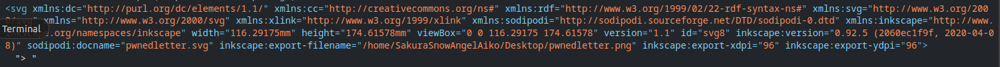

# Task 2:TIP-OFF
In this challenge, we have to find the username of the attacker from the [image](https://raw.githubusercontent.com/OsintDojo/public/3f178408909bc1aae7ea2f51126984a8813b0901/sakurapwnedletter.svg) left by the attacker.

## Writeup
In the image's background, some binary was visible So I converted it to text using ASCII/UTF-8 encoding on [this](https://www.rapidtables.com/convert/number/binary-to-ascii.html) website.
(To copy the binary: Right-Click then `Edit as HTML`)
```Binary
01000001 00100000 01110000  01101001 01100011 01110100  01110101 01110010 01100101  00100000 01101001 01110011  00100000 01110111 01101111  01110010 01110100 01101000  00100000 00110001 00110000  00110000 00110000 00100000  01110111 01101111 01110010  01100100 01110011 00100000  01100010 01110101 01110100  00100000 01101101 01100101  01110100 01100001 01100100  01100001 01110100 01100001  00100000 01101001 01110011  00100000 01110111 01101111  01110010 01110100 01101000  00100000 01100110 01100001 01110010 00100000 01101101 01101111 01110010 01100101
```
```ASCII
A picture is worth 1000 words but metadata is worth far more
```
Then I used `inspect` to look at image's metadata where I saw:


From this part:
```HTML
inkscape:export-filename="/home/SakuraSnowAngelAiko/Desktop/pwnedletter.png"
```
I found the username.

## Answer 
SakuraSnowAngelAiko
