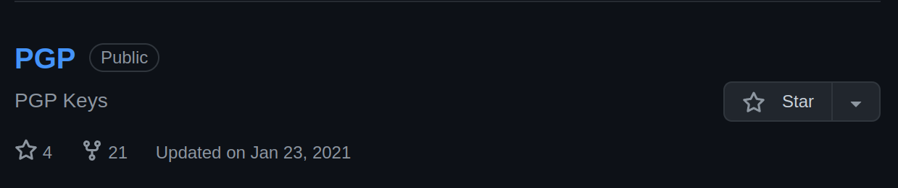
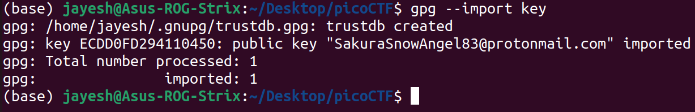

# Task 3: RECONNAISSANCE
In this task, we are told that the attacker has used the same username across other social media platforms and we have to fing his email address and full realname.

## Writeup
Since he used the same username across other social media platforms, I searched for the username and found a `github` account and a `linkedIN` with that username.

### Email
On the attacker's github account, I found a repository called `PGP` which is an Email encryption program.



This repo contained `PGP keys`. So I copied the key to a `file` and named it key. Then to get the email, I used the command:
```bash
gpg --import key
```
This gave:



From here I got the email.

### Full Real Name
From the attacker's LinkedIn, I found his full real name.

## Answers
Email: SakuraSnowAngel83@protonmail.com
Real Name: Aiko Abe
