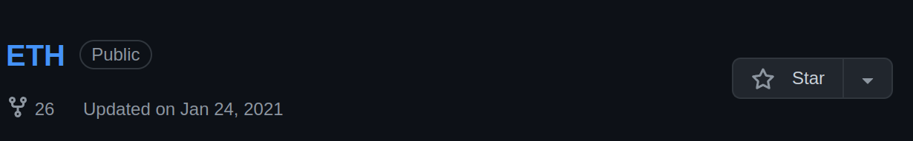
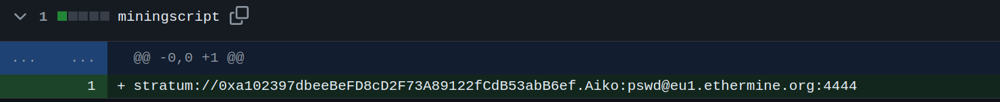
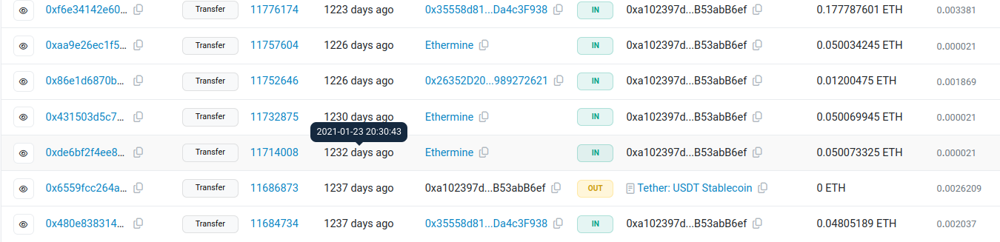

# Task 4: UNVEIL

## Writeup

### What cryptocurrency does the attacker own a cryptocurrency wallet for?
In the attacker's github repositories, there is a github repo called `ETH`.

By a quick google seach, I found out ETH is cryptocurreny Ethereum and ETH wallet is used to store it.

### What is the attacker's cryptocurrency wallet address?
To find the attacker's cryptocurrency wallet, I looked into the `ETH` repository and in the commit history, I found two commits. When I checked the first commit, I found the address.

### What mining pool did the attacker receive payments from on January 23, 2021 UTC?
To find it, I did a quick Google Search for `ETH wallet history` and came across [this](https://etherscan.io/) website. When I entered the attacker's cryptocurrency wallet address, I received this output: 

Here, I found the sender was Ethermine.

### What other cryptocurrency did the attacker exchange with using their cryptocurrency wallet?
In the attacker's transaction history, we can the other cryptocurrency is Tether.

## Answers

  
What cryptocurrency does the attacker own a cryptocurrency wallet for?

  Ethereum

  
What is the attacker's cryptocurrency wallet address?

0xa102397dbeeBeFD8cD2F73A89122fCdB53abB6ef

  
What mining pool did the attacker receive payments from on January 23, 2021 UTC?

Ethermine

  
What other cryptocurrency did the attacker exchange with using their cryptocurrency wallet?

Tether

